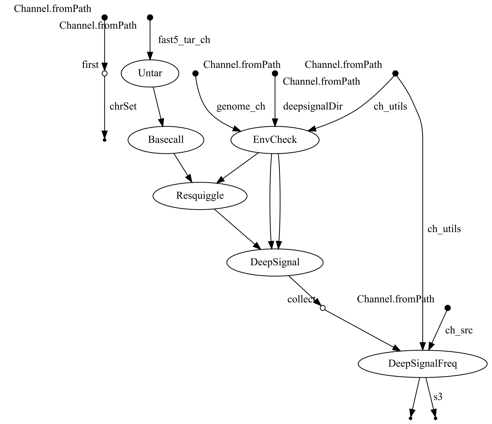
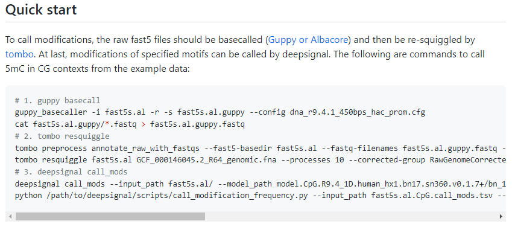
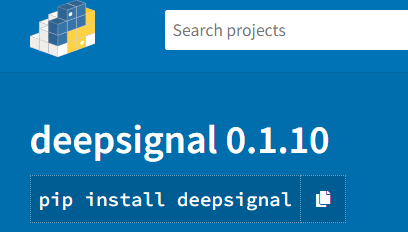
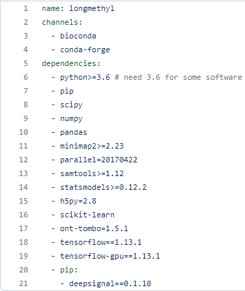
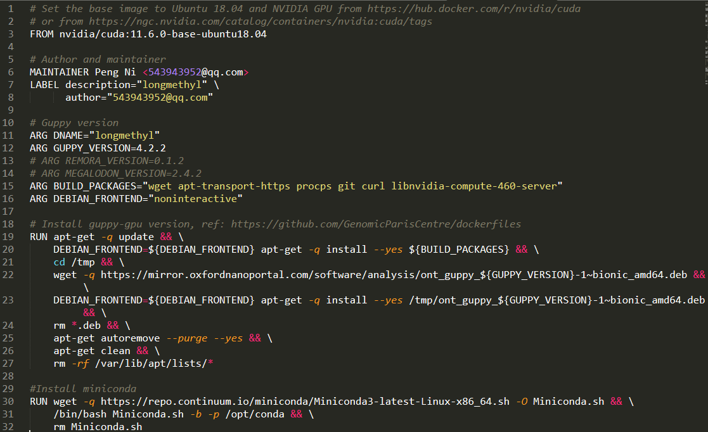
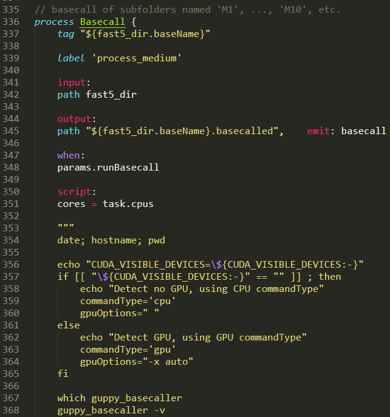
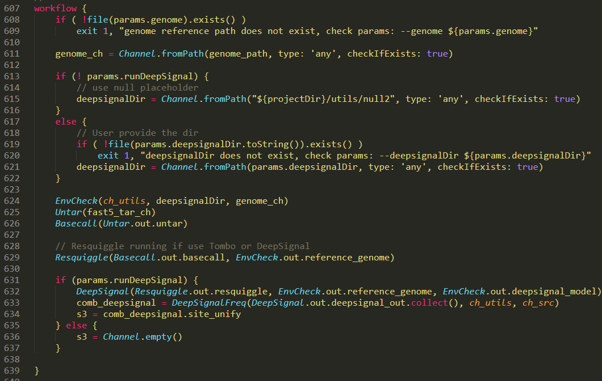
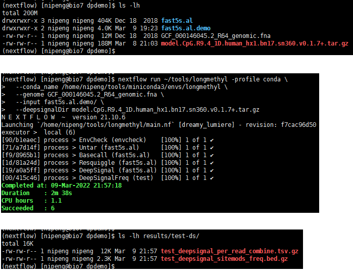

## nextflow流程开发

以DeepSignal流程为例

### Contents
* [1 nextflow流程目标用户](#1-nextflow流程目标用户)
* [2 开发流程需要准备](#2-开发流程需要准备)
* [3 nextflow流程开发](#3-nextflow流程开发)
* [4 测试](#4-测试)
* [5 流程参考](#5-流程参考)
* [6 其他参考](#6-其他参考)


### 1 nextflow流程目标用户

熟悉shell常用命令

### 2 开发流程需要准备

#### (1) 流程中每个工具步骤的输入输出，参数详解

DeepSignal步骤：

# 

# 
参考：[https://github.com/bioinfomaticsCSU/deepsignal#quick-start](https://github.com/bioinfomaticsCSU/deepsignal#quick-start)

#### (2) 源码及依赖
  * __github__

  * __conda__/bioconda（推荐，方便环境配置） 

  * __pypi__ (python packages)

# 

  * __r-cran/Bioconductor__ (R packages) 

#### (3) 熟悉nextflow相关知识

  * Nextflow

  * Shell

  * Conda/Docker

### 3 nextflow流程开发

#### (1) 环境依赖配置

  - conda

用environment.yml管理依赖。

示例：
# 

参考：[longmethyl/environment.yml](../environment.yml)

  - docker（推荐）

利用docker配置依赖和自安装包，编写Dockerfile。

```sh
cd longmethyl/
# run docker build
docker build .
# or add tags
docker build -t nipengcsu/longmethyl:0.2 .
# push to dockerhub [create repo in docker hub first, and login required]
docker push nipengcsu/longmethyl:0.2
```

示例：
# 

参考：[longmethyl/Dockerfile](../Dockerfile)

#### (2) 流程开发，编写nextflow语句

从[main.nf](../main.nf)开始编写nextflow流程，配置参数在[nextflow.config](../nextflow.config).

  - process举例：

# 

  - workflow举例：

# 

### 4 测试

#### (1) 安装nextflow
#### (2) 下载longmethyl流程源码
#### (3) 准备数据，运行程序

deepsignal流程需准备：fast5 files, genome fasta, model.ckpt

# 

详见[README.md](../README.md)。


### 5 流程参考

#### (1) nf-core (DNA-seq, RNA-seq, Chip-seq, ...; nextflow)
  - [https://nf-co.re/](https://nf-co.re/)
  - [nf-core-GitHub](https://github.com/nf-core)
  - [nf-core-natbiotech-paper](https://www.nature.com/articles/s41587-020-0439-x)

#### (2) METEORE (ONT-5mCpG; snakemake)
  - [METEORE-GitHub](https://github.com/comprna/METEORE)
  - [METEORE-ncomm-paper](https://www.nature.com/articles/s41467-021-23778-6)

#### (3) nanome (ONT-5mCpG; nextflow)
  - [nanome-GitHub](https://github.com/TheJacksonLaboratory/nanome)
  - [nanome-genomebiology-paper](https://genomebiology.biomedcentral.com/articles/10.1186/s13059-021-02510-z)

#### (4) CulebrONT (ONT-assembly; snakemake)
  - [CulebrONT-GitHub](https://github.com/SouthGreenPlatform/culebrONT)
  - [CulebrONT-biorxiv-paper](https://doi.org/10.1101/2021.07.19.452922)

#### (5) PRINCESS (Longreads-snv-sv-5mCpG; snakemake)
  - [PRINCESS-GitHub](https://github.com/MeHelmy/princess)
  - [PRINCESS-genomebiology-paper](https://genomebiology.biomedcentral.com/articles/10.1186/s13059-021-02486-w)

#### (6) master of pores (ONT-DRS; nextflow)
  - [MOP-GitHub](https://github.com/biocorecrg/MOP2)
  - [MOP-fgene-paper](https://doi.org/10.3389/fgene.2020.00211)

#### (7) preprocess of Nanocompore (ONT-DRS-m6A; nextflow)
  - [Nanocompore-GitHub](https://github.com/tleonardi/nanocompore)
  - [Nanocompore-ncomm-paper](https://www.nature.com/articles/s41467-021-27393-3)

#### (8) MeRIPseqPipe (MeRIP-seq-m6A; nextflow)
  - [MeRIPseqPipe-GitHub](https://github.com/canceromics/MeRIPseqPipe)
  - [MeRIPseqPipe-bioinformatics-paper](https://doi.org/10.1093/bioinformatics/btac025)


### 6 其他参考
  - Wratten, L., Wilm, A. & Göke, J. Reproducible, scalable, and shareable analysis pipelines with bioinformatics workflow managers. Nat Methods 18, 1161–1168 (2021). DOI: [https://doi.org/10.1038/s41592-021-01254-9](https://doi.org/10.1038/s41592-021-01254-9)
  - [Reproducible, scalable, and shareable analysis workflows with Nextflow](https://sateeshperi.github.io/nextflow_varcal/nextflow/)
  - [Nextflow training of seqera](https://training.seqera.io/)
